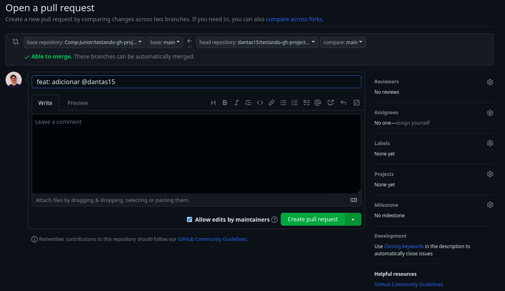

# Onboarding

- Em primeiro lugar, bom momento a todos! Sejam bem-vindos ao time de projetos da Comp!
- Este é um desafio para que vocês possam se familiarizar com o GitHub e com o processo de contribuição em um repositório open-source.
- Antes de começar a fazer o desafio, você **precisa** tê-lo configurado em sua máquina (ou em outra que você for utilizar para realizar o desafio), para isso, você deve ter aprendido o [básico de Git e GitHub no Athena](https://athena.compjunior.com.br/trilhas/introducao/#hora-de-botar-a-m%C3%A3o-na-massa).
- O objetivo é que vocês adicionem seus nomes e links para seus perfis no GitHub no arquivo `trainne.md` seguindo o exemplo abaixo:

```markdown

## Sua primeira contribuição

> Lembre-se de mudar os nomes `usuario_teste` para o seu próprio nome no GitHub

- Crie um `fork` do repositório para sua própria conta
- Clone o `fork` do repositório na sua máquina

```bash
git clone git@github.com:usuario_teste/fork_do_docs.git
```

- Entre na pasta do repositório clonado:

```bash
cd fork_do_docs
```

- Crie uma branch:

```bash
git checkout -b feature/adicionando-usuario_teste
```

- Agora você criou uma branch e trocou para ela automaticamente, agora é hora de fazer suas alterações:
- No arquivo `trainne.md` adicione seu nome com seu link para o seu perfil no GitHub abaixo do título do período que você ***ingressou***:

```markdown
[...]
## 2024-1
...
- [Usuario Teste](https://github.com/usuario_teste)
```

- Depois disso, você pode fazer o commit:

```bash
git add . && git commit -m "feat: adicionar @usuario_teste"
```

- Faz o push

```bash
git push origin HEAD
```

- Agora, é hora de contribuir pelo próprio GitHub:

1. Vá para o repositório que você fez o fork
2. Aparecerá a seguinte mensagem (ou algo parecido): 
3. Clique em "Contribute" e "Open Pull Request"
4. Depois, preencha o nome do que está sendo feito no seu PR:
5. Depois é só clicar em "Create pull Request"!
6. Aguarde possíveis feedbacks que serão passados no próprio PR ou, se estiver tudo certo, esperar ser aprovado!
